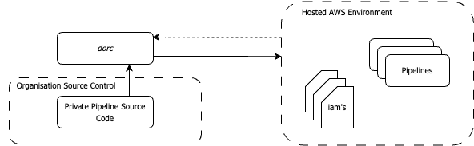

*dorc* is the internal data orchestration library of 10 Downing Street.

*dorc* enables the definition of serverless data projects using Python code and automatic deployment into any Amazon Web Services environment.

Overview
Below is a typical project structure to follow when setting up *dorc*. Within your organization's source control environment, you would have the *dorc* repository alongside your private source code repository. *dorc* contains all the necessary code to deploy the required infrastructure, as well as the Python models used to define your pipelines. You would then define your pipeline and configuration code in a separate repository that you pass to *dorc*.

The visual representation below depicts a typical *dorc* setup, illustrating the above description.

## Motivation for *dorc*

At Number 10, we faced the challenge of abstracting away the complex infrastructure code required when building a data orchestration project from a repository. Our goal was to enable data scientists and analysts to focus on writing pure pipeline code without having to deal with custom infrastructure-as-code or maintain extensive lists of configuration YAML files.

Additionally, we aimed for the orchestration to be cost-effective, scalable, and easy for scientists to learn. While Prefect, Dagster, and Airflow offer a good infrastructure abstraction from the repository, they are not inherently serverless and require the deployment of multiple services.

*dorc* was created to address these concerns. It is built entirely on AWS and embraces a serverless approach. Under the hood, *dorc* leverages Amazon Step Functions, a highly scalable service for distributed orchestration.

## Structure of *dorc*

As previously mentioned, *dorc* handles all the code required to deploy serverless pipeline infrastructure. To accomplish this, *dorc* is divided into three core packages.

Universal: This package creates environment-agnostic infrastructure that is utilized across the entire stack. For example, it reads the folder structure from within the private source code repository, determines which pipelines will be created, and creates the respective AWS Elastic Container Registry to host the built pipeline code.

Infra: This package is responsible for environment-specific infrastructure. It includes the creation of AWS IAM roles and policies at the environment level. When pipelines are deployed to a specific environment, they utilize the infrastructure resources defined in this package.

Core: The main Python infrastructure code used when deploying a new pipeline to an environment resides in this package. The pipeline definition is defined and passed into the infrastructure. *dorc* then handles the building and deployment of each function, ultimately constructing the pipeline based on the provided definition.
